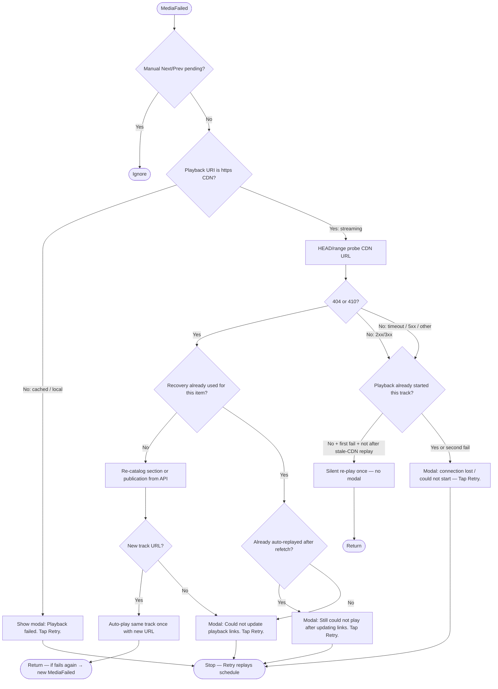

# Media failed during playback

**Buffering / open phase:** While the stream has **not** yet successfully started (`PlayTrackAsync` completed), the first `MediaFailed` triggers **one silent re-play** (no modal). Loading/Buffering UI is unchanged. A **second** failure before playback starts shows the modal.

**After playback started:** Any `MediaFailed` shows the modal with Retry (e.g. connection lost mid-stream).

Cached files use a local path URI (not `http`); streaming uses `https`.

**Actual automatic alarm on Android** (`PrepareAndPlayAsync(..., isAlarm: true)`): same modal flow as above; the **device default ringtone** loops until Retry/Dismiss/stop. **Not** used when playback was started via notification tap, home Play, or `PlayScheduleAsync` (`isAlarm: false`). **Retry** uses `PlayScheduleAsync` (no ringtone on later errors in that session).

**iOS / Windows:** no failure ringtone (those entrypoints are user-initiated via notification or UI).

---

## Other failures → same modal + Retry (user-initiated playback)

When **`IsAlarm` is false** and there is an active **`CurrentScheduleId`**, failures that previously called **`HandlePlaybackFailureAsync`** after a full reset (e.g. **EnsureTrackPrepared** / **PlayTrackAsync** failure, manual Next/Prev resolution failure) now use the **same “keep session” path** as **MediaFailed**: **Failed** status, error text, **Retry** still enabled. **Alarm** sessions still use **reset + fallback sound** (or prior alarm-specific handling) where applicable.

---

## Indefinite playback: ad-hoc fetch fails at end of playlist

When the last in-memory track ends and the app tries to **append** the next track (ad-hoc section/catalog fetch), **before** advancing the schedule in the DB it runs that fetch. If append fails:

- **`PersistSchedulePointerToFinishedTrackAsync`** writes the schedule’s Bible (or Music) pointer to the **track that just finished** (same section/track as the item that ended).
- User sees the **playback error modal** with **Retry** (and device ringtone for actual alarms), same family as other playback errors.
- **Retry** / next **Play** rebuilds from the DB, so playback **starts again from that finished track**; when it ends, the append + ad-hoc fetch is attempted again.
