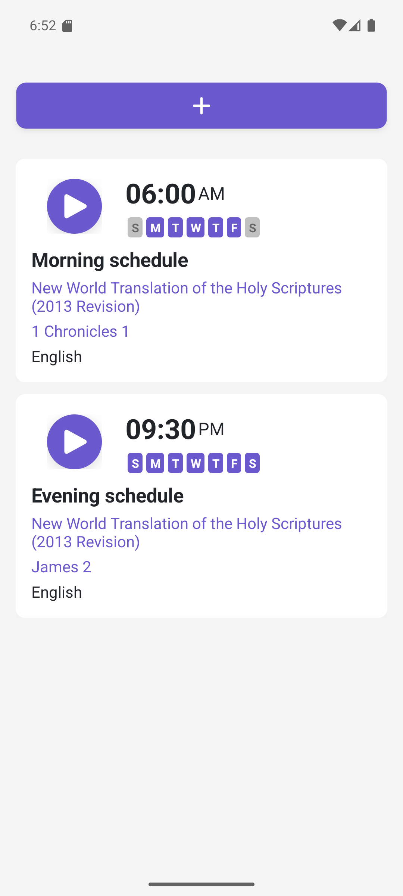
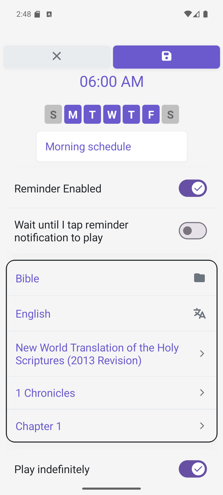
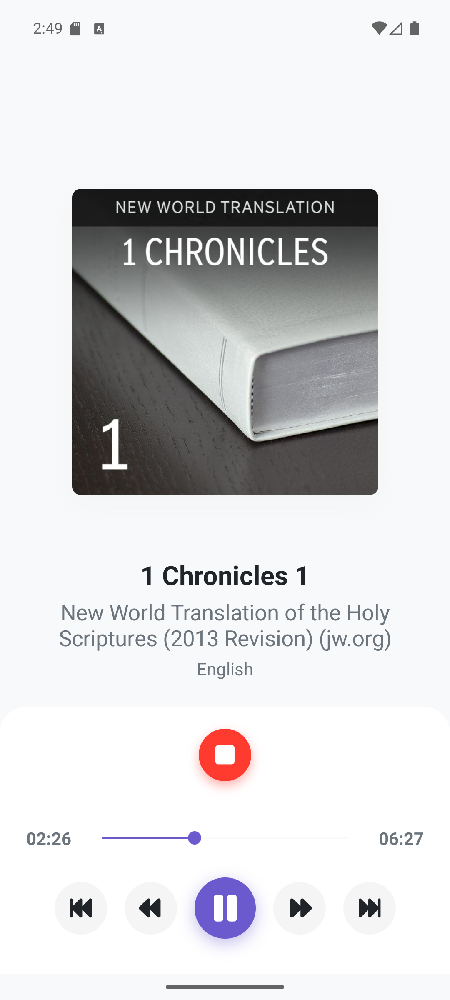
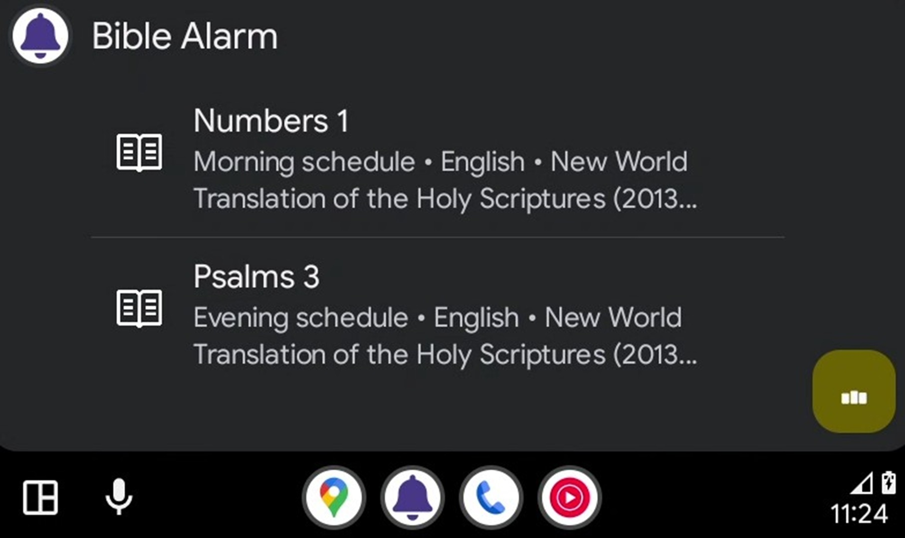
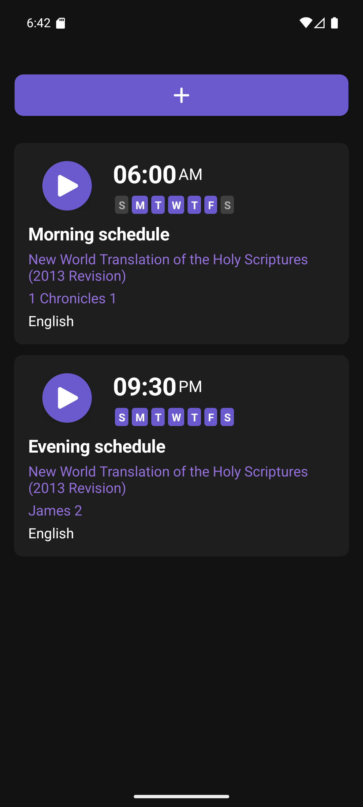
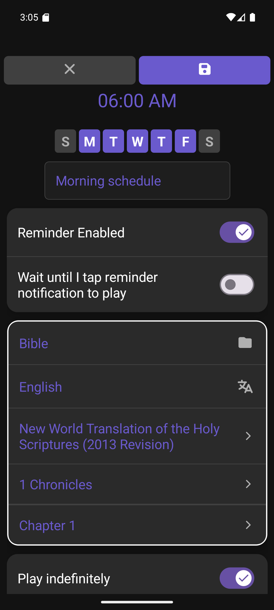
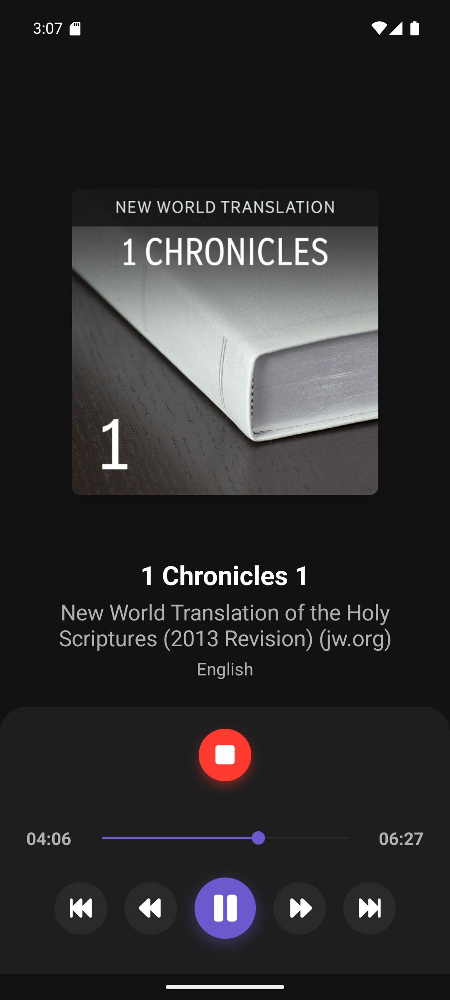

# Bible-Alarm

@justcoding121. All rights reserved.

## CI/CD Status

### Build

### Deployment

## Code Quality

## Download

- **Apple Store**: [Download on App Store](https://apps.apple.com/us/app/bible-alarm/id1513519477?platform=iphone)
- **Android Store**: [Get it on Google Play](https://play.google.com/store/apps/details?id=com.jthomas.info.Bible.Alarm)
- **Windows Store**: [Get it from Microsoft Store](https://apps.microsoft.com/detail/9nhzhb85v6r4)

## Screenshots

**Android (phone)** — Home · Schedule · Playback

  

**Android Auto** — Listing · Playback

 

**Android (phone, dark)** — Home · Schedule · Playback

  

*(All Android assets: phone, tablet-7, tablet-10, and android-auto, are under [`docs/screenshots/Android/`](docs/screenshots/Android).)*

## License

This project is licensed under the **GNU Affero General Public License v3.0 (AGPL-3.0)**.

This is a copyleft license that requires anyone who distributes this software or modifications of it to make the source code available under the same license. This license is particularly restrictive and ensures that all modifications and derivative works remain open source.

**Key restrictions:**
- You must disclose the source code when you distribute the software
- You must license derivative works under the same AGPL-3.0 license
- You must make the source code available to anyone who uses the software over a network (even if they don't receive a copy)

For the full license text, see the [LICENSE](LICENSE) file in this repository.

**If you need a different license for commercial use, please contact the copyright holder.**
