# Bible-Alarm

Jehonathan Thomas (@justcoding121). All rights reserved.

## Get the app

- **Apple Store**: [Get it on the App Store](https://apps.apple.com/us/app/bible-alarm/id1513519477?platform=iphone)
- **Android Store**: [Get it on Google Play](https://play.google.com/store/apps/details?id=com.jthomas.info.Bible.Alarm)
- **Windows Store**: [Get it from Microsoft Store](https://apps.microsoft.com/detail/9nhzhb85v6r4)

## Screenshots

**Android (phone)** — Home · Schedule · Playback

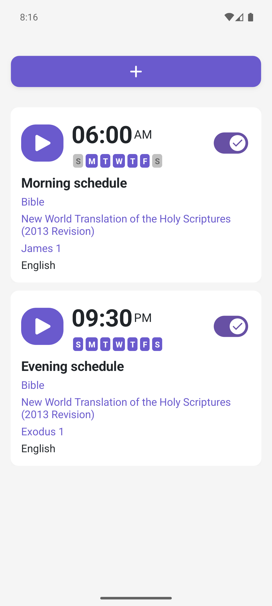 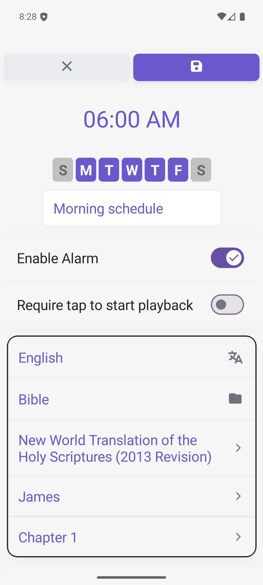 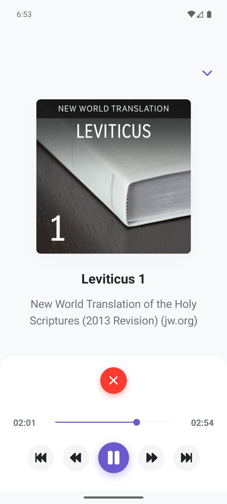

**Android Auto** — Listing · Playback

 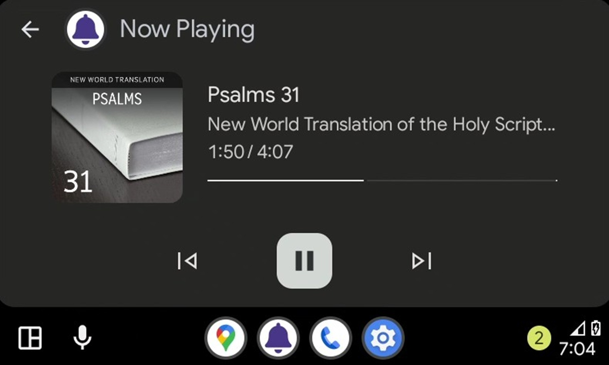

*(All Android assets: phone, tablet-7, tablet-10, and android-auto, are under [`.docs/screenshots/Android/`](.docs/screenshots/Android).)*

**Windows dark** — Home · Schedule · Playback

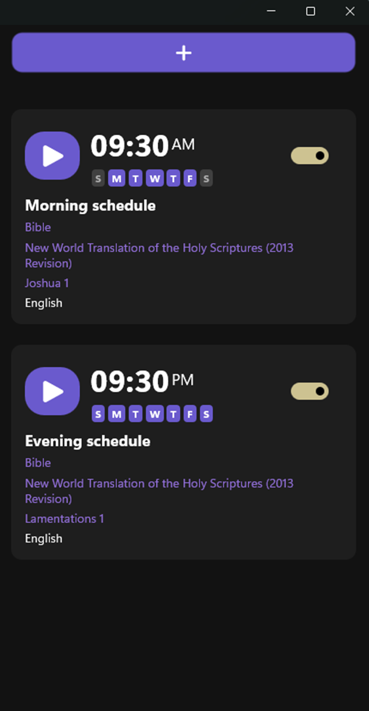 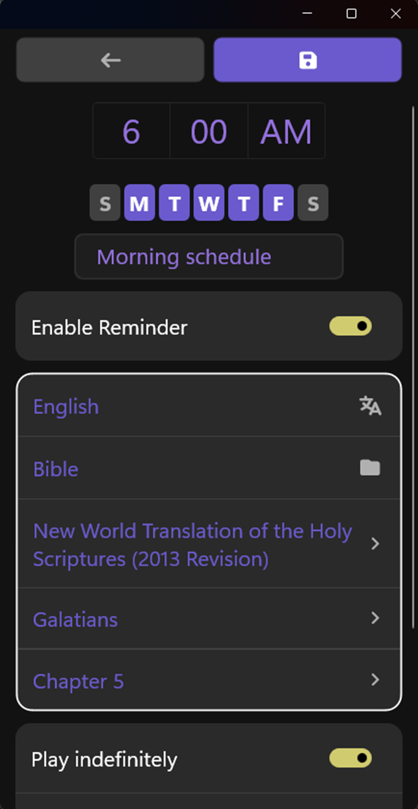 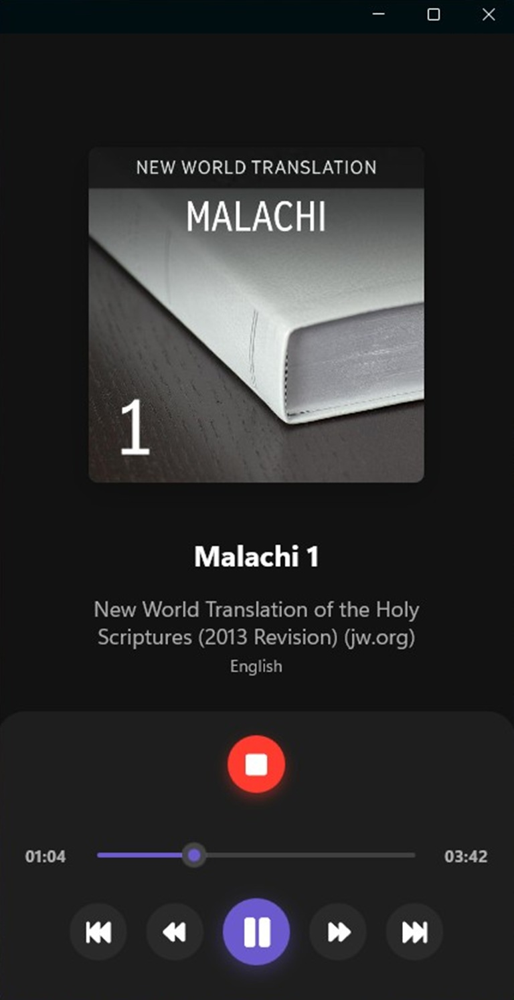

*(Windows assets are under [`.docs/screenshots/Windows/`](.docs/screenshots/Windows).)*

**iOS (phone)** — Home · Schedule · Playback *(light)*

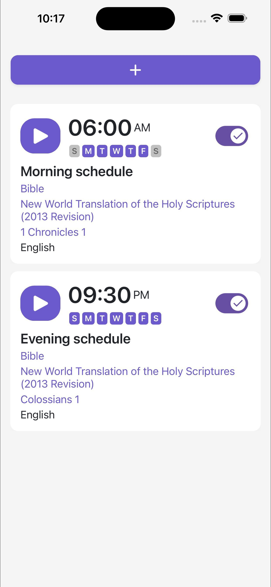 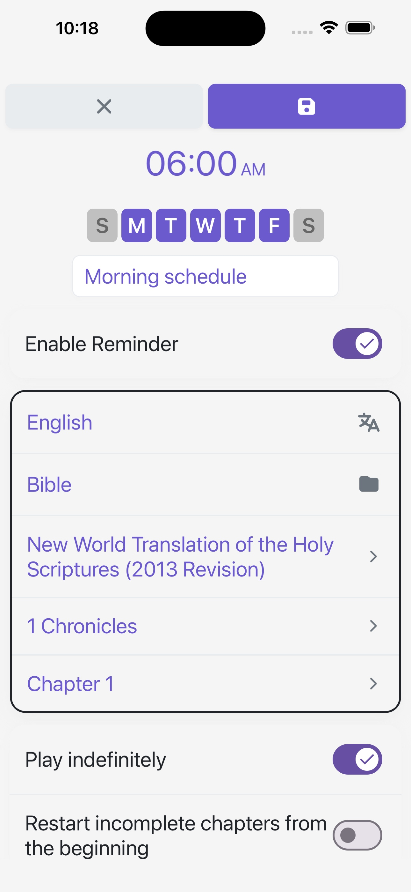 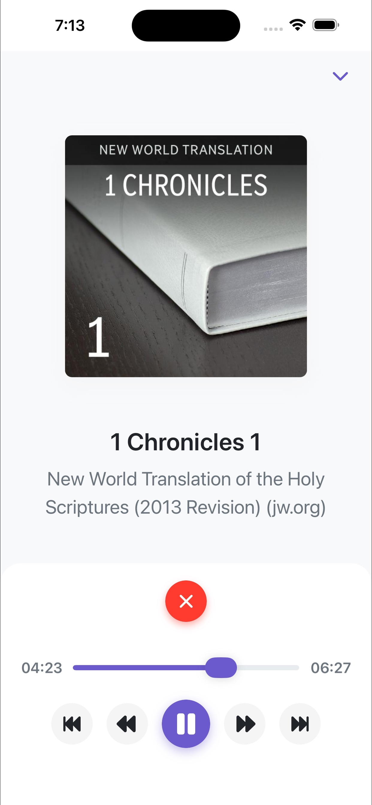

**Apple CarPlay** — Listing · Playback

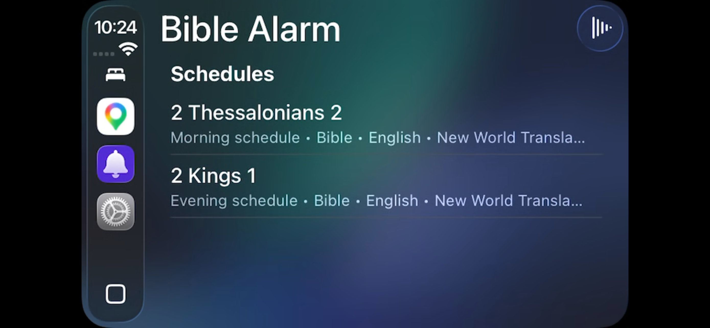 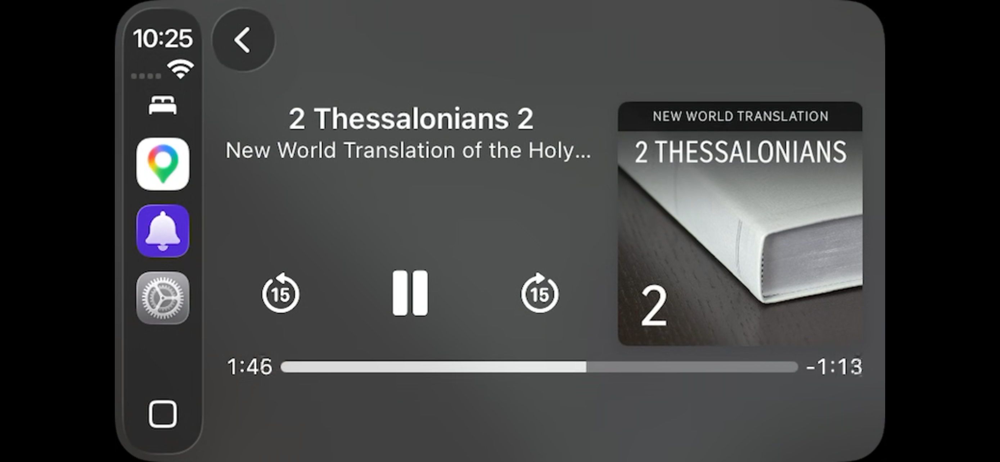

*(iOS assets: phone, tablet, and carplay are under [`.docs/screenshots/iOS/`](.docs/screenshots/iOS).)*

## Code quality

## Terms of Use

This app is non-commercial and free, with no advertisements; the publisher gains nothing monetarily. The app adheres to the terms of use for third-party apps as stated on [jw.org](https://www.jw.org/en/terms-of-use).

> "This does not prohibit the distribution of free, non-commercial applications designed to download electronic files such as EPUB, PDF, MP3, and MP4 files from public areas of this site."

## License

Original work in this repository is licensed under the **PolyForm Noncommercial License 1.0.0** (see [LICENSE](LICENSE)).

**In short:**
- Use, modification, and distribution are allowed for **noncommercial** purposes only (as defined in the license).
- **Forks and derivatives** must stay **noncommercial** and **revenue-free**: anyone who receives a copy must receive the same terms; commercial use and monetization of the software or derivatives are not licensed except where PolyForm Noncommercial explicitly allows.
- **Third-party / vendored code** (for example under `libraries/`) stays under its own license files.

Official license terms: [PolyForm Noncommercial 1.0.0](https://polyformproject.org/licenses/noncommercial/1.0.0).
